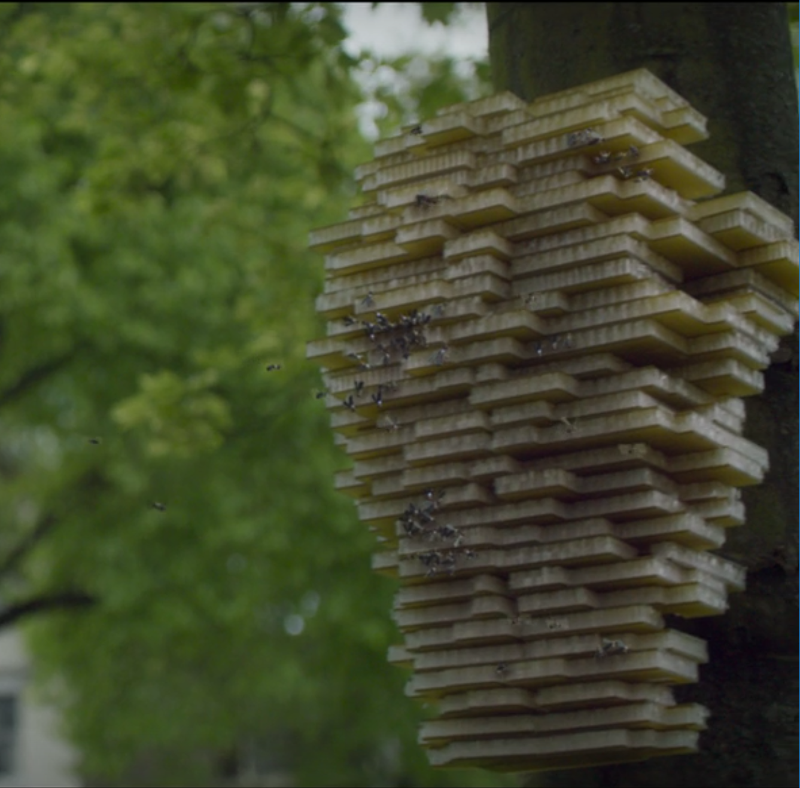
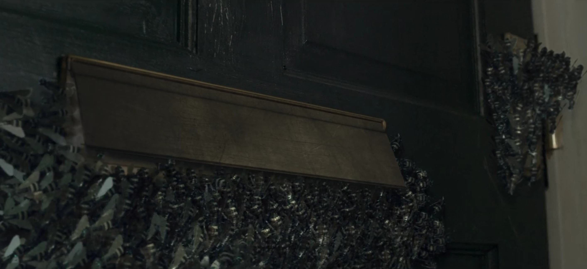

<!-- 
- [ ] aufteilen - wer sagt was?
- [ ] TODOs durchgehen
- [ ] folientext ausformulieren
- [ ] bilder an passende stellen einfuegen
- [ ] notes ausformulieren
-->

# Hated In the Nation

Content Note: 
remote killing, dehumanization. also, some gifs to lighten up the mood every now and then

Note:
some notes here
start presentation with information that the episode deals with Dual Use and Back Doors, with sprinkles of image/facial recognition, 3d printing/federating and cyber bullying

also, we want to make the presentation less linear and will inlcude information on the plot throughout the presentation where/when it fits

<!--
screenshots:

* [x] an ADI
* [x] bee-central: one of the hives  
* [x] bee-central: map with all the bees  or  or  or  or 
* [ ] facial recognition, falls irgendwo sichtbar
  * not from the episode and different style, but facial recognition: 
  * also not from episode, but at least photo: 
* [x] organised bee-swarm
  * at bee-central: 
  * static of swarm attacking: 
  * 
* [x] death list (bee-central, letzter besuch) 
* [x] cyber bullying-example (entweder am anfang bei jo powers oder spaeter eine der suchen nach dem #deathTo tag) - mit #deathTo tag 
  * more deatTo: 
* [x] bild von der big-ass database
  * 

-->

---

# Dual Use I

<blockquote> 
 …goods, software and technology that can be used for both civilian and military applications and/or can contribute to the proliferation of WMDs…
  </blockquote> 
<cite>European Commission, [15]</cite>

Note:
* what is civil, what is military? where/what is police work? if police is civil, then there are lots of technologies with harmful intents.
* what constitutes a  weapons of mass destruction (WMD) -- are the ADIs WMDs? [11]

---

# Dual Use II

<blockquote> 
  for military or other purposes with non-peaceful intents (…) like artificial intelligence and genetics which can be easily weaponised
</blockquote>
  <cite>Datta Burton et al. [10], p. 5</cite>
  
---

# Dual Use III

<blockquote> 
 does your research affect current standards in military ethics? Does your research involve the development of technologies or the creation of information that could have severe negative impacts on human rights standards (e.g. privacy, stigmatization, discrimination), if misapplied?
</blockquote>
  <cite>Datta Burton et al. [10], p. 23</cite>

Note:
* this is the 2014 version of the EU DU checklist 
* ethics checklist on DU is a requirement only for researchers who want their project to be funded by the EU?
* it's all about the trade-offs -- economy vs. personal security, surveillance, privacy, human rights, ...
* see also discussion about China having an advantage because they don't care about ethics "as much as Europe does" (which IMO is not much to begin with)

---

# Autonomous Drone Insects (ADIs)

  
Note:
* artificial honey bee replacement
* used for pollination
* not controlled by a central server
*  self-replicating
* used civilly to prevent environmental catastrophe
* because honey bees have died out - and as we all know, no other insects pollinate, ever
* open question: do they produce honey?

---

## ADIs - Second Use

 

source: [wikimedia](https://commons.wikimedia.org/wiki/File:Predator_and_Hellfire.jpg)

Note:
* funded by the government
* have a backdoor for surveillance
* government/secret service use them

* massive privacy invasion
* bees are basically invisible -> hard to protect against
* data *is* transmitted, we see examples of videofeeds and position data

---

## Spoiler Alert!

Note:
* basic problem of backdoors: 
* they can be used by third parties

---

## ADIs - Backdoor

<!--
static with speech-bubbles:
https://www.google.com/search?biw=1525&bih=735&tbm=isch&sa=1&ei=MTwFXKrRPIWWjgbO7In4DA&q=nein+doch+oh+gif+captions&oq=nein+doch+oh+gif+captions&gs_l=img.3...6042.7126..7281...0.0..0.152.1084.0j8......1....1..gws-wiz-img.jL5PXueaZfQ#imgrc=62Gl4KCFEgT9AM:
-->

Note: 
* they got hacked.
* security-diskussion entweder hier oder später mit anderen "improvements"

---

## Introduction: the plot

TODO: picture?

Note:
* someone took over ADIs
* and used them to kill people
* controlled via unknown means 
* (spoiler: they were hacked)
* honey bees have died out
* they've been replaced by ADIs - because there's no other insect that could possibly pollinate plants

---

## Image Recognition

Note:
* used by ADIs to find victims
* dual use: 
  * helping you sort and find pictures
  * used for surveillance
* anderes "tolles" dual-use example
* side-rant über face-recognition
* side-rant über mangelnde responsibility von researchern

* facial recognition: 
really not as good as people say it was. cf Berlin Südkreuz, with "success" rates of about 75 % (resulting in hundreds of false positives for ONE true positive)

---

## 3D Printing

Note:
* ADIs are self-reproducing devices
* dual use:
  * easily getting replacement parts
  * ???
* offensichtlich auch in militärischem Kontext nutzbar, weil was einen schraubenschlüssel printen kann, kann auch munition machen
* ebenfalls dual-use, weil sowohl in civil als auch military contexts nutzbar
* ADIs build hives, hives reproduce ADIs (from what resources, though?)

---

# plot - target selection

Note:
* targets are selected via pseudo twitter
* recognised via uploaded image and image recognition
* "the game of consequences"
* somehow, ADIs kill a person if their name & picture got shared under a hashtag on a twitter-like social media often enough

---

# Exkurs: Cyber Bullying

TODO: screenshot here [] (jo powers' twitter stream)

Note:

not part of the papers, but relevant here

ask whether game of consequences is a good way to deal with cyber bullying

---

# that big-ass database

TODO: text

Note:
intro. spielt nur als großes telefonbuch eine rolle, hat aber auch großes dual use potential -- reverse image lookup offensichtlich möglich!

also something about surveillance here

most unrealistic part: current, good-quality pics of everyone

---

# Back to: the Plot

wir lernen: ADIs haben ein hive mind und koennen kooperieren

next victim found via pseudo twitter

bees can cooperate

TODO: screenshot here [] (bees cooperating to break down windows)
static: 
gif: 

Note:
* bees will cooperate
* bees are pretty much unkaputtbar
* discussion note: bees are only turned off when prime minister gets targeted -> some are more equal

---

# Kill List

Note:
* turns out, some guy does this because his girl friend got bullyied on social media and he wants to show that bullying is bad
* actual "game of consequences" is triggered by bee-killswitch
* victims are those that used #deathTo

* several countries groups *have* kill lists
* eg: the US, Syria, the NATO, Russia,... [16]
* terrorists, "dangerous people", etc.

---

# Terror Tuesday

TODO: death note image

Note:
* terror tuesday: weekly time in the POTUS' schedule for approving targeted assassinations
* targeted assassinations from: all the above, frankreich, the UK
* quellen: [16], [17], [18]

<!-- the drone-strike on family vid  - Nope, too graphic/depressing -->

---

# Drone Killings

Photo: [Stephen Melkisethian](https://www.flickr.com/photos/stephenmelkisethian/15440228802/in/photolist-pwpd6q-o2xXcV-nhy3vH-36BKyv-bYcJ6s-66E8fu-bXvxgm-hs9gHM-fmBB1X-iLvBb7-nkTfWJ-dHkxbE-3jAjTF-kGJLiY-a1gXcN-kjTPNB-euGaH9-g3GVCn-hpDP1Z-puotz9-e2fUQf-dkLpYZ-qMUsc4-DhciEQ-tVgwTv-8C7wnY-niNBDQ-omi8xg-4Ajswp-qk6NXE-dp2Qz9-f81YTF-rAHRTd-rmSK2J-nXgmr3-7pcaik-oageb3-7pg2Sb-eiA5LB-7ByiT3-qhDigK-7J6MzM-nVEe35-mhxdbk-qokmec-bbHupc-7JaJ21-dJp7Q3-p8KpeC-kMJGxx) / Flickr Creative Commons

source:  “Most US Drone Strikes in Pakistan Attack Houses.” The Bureau of Investigative Journalism. Accessed December 17, 2018. https://www.thebureauinvestigates.com/stories/2014-05-23/most-us-drone-strikes-in-pakistan-attack-houses. 

  
Note:

* currently happening - see terror tuesday
* close to episode, but smaller drones in episode

---

# Drone Killings II

<iframe width="560" height="315" src="http://drones.pitchinteractive.com/" frameborder="0" allowfullscreen></iframe>

Note: 
* information on drone strikes in Pakistan since 2004
* bar on top shows: number of killings in categories -- left to right: children, civilians, high profile, "other"
* graphic below: same data as above, but for each drone strike 

--- 

# Recap - angesprochene Themen

* Autonomous Drones
* Image Recognition
* 3D Printing
* Surveillance
* Cyber bullying
* Drone killings

---

# Potential Fixes

TODO: some GIF, because I can't think of useful text here

Note:
bees: can't really be made "hacking proof" - see discussion we've had
environmental conservation effort probably preferable
plus, there are other pollinating insects, we promise

dual use: only with increased ethical understanding of computer scientists, which is a whole other can of worms

other stuff

---

# Discussion Questions

What do you think about the **"game of consequences"**?

What is scarier: autonomous killer drones existing or being controlled by majority vote? <!-- not sure about this one; sthg related to how present-time killer drones are controlled -->

Where do you think the **biggest fuck-up** leading to this scenario happened?

Do you think using the **ADIs for surveillance** is defensible? What about that **database**?

---

# Sources

<!-- TODO chicago-style me -->

[09]: Datta Burton et al. 2018 = report  
[10]: Datta Burton et al. 2018a = presentation

[11]:  https://web.archive.org/web/20070311090139/http://www.timesonline.co.uk/tol/news/uk/article1013136.ece
[12]: https://www.news.at/a/personenstandsregister-daten-zusammengefuehrt
[13]: https://www.bmi.gv.at/414/start.aspx
[14]: https://derstandard.at/2000007395181/Personenstandsregister-Das-Standesamt-ist-ein-Serverraum
[15]: http://ec.europa.eu/trade/import-and-export-rules/export-from-eu/dual-use-controls/index_en.htm
[16]: https://www.the-tls.co.uk/articles/public/state-sponsored-assassination/
[17]: https://www.huffingtonpost.com/john-w-whitehead/terror-tuesdays-kill-list_b_1606371.html
[18]: https://www.theguardian.com/world/2013/jul/14/obama-secret-kill-list-disposition-matrix

---

