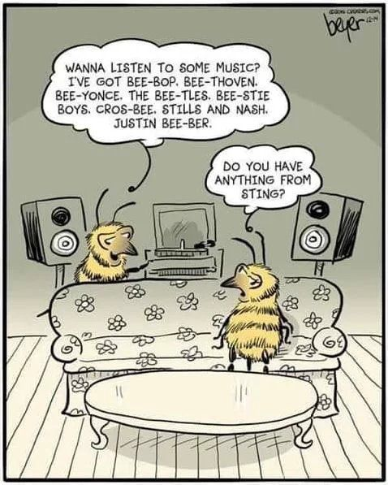
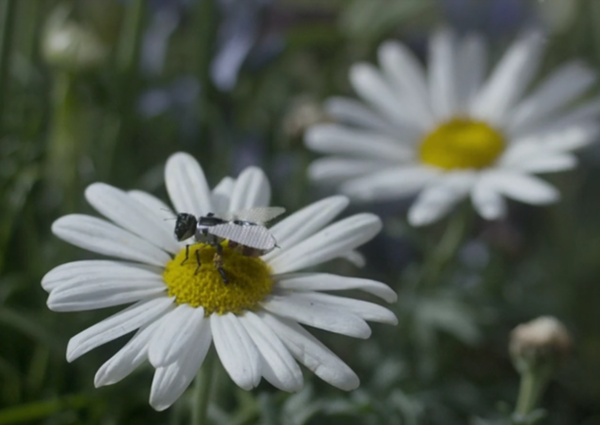
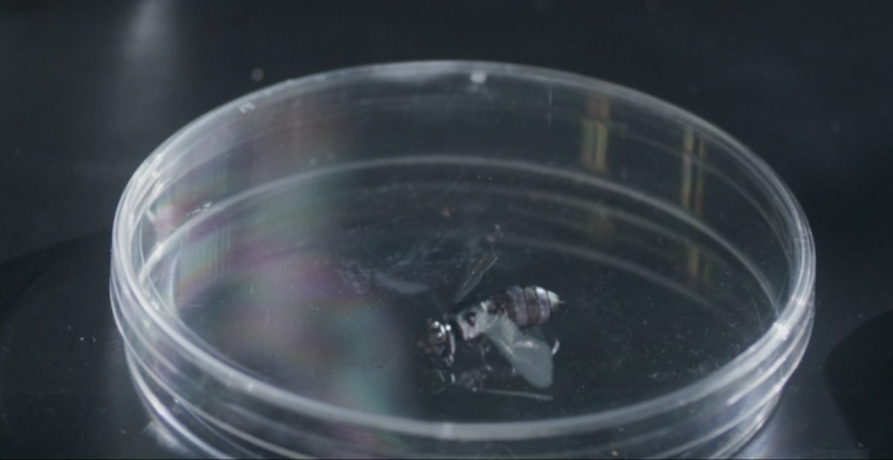
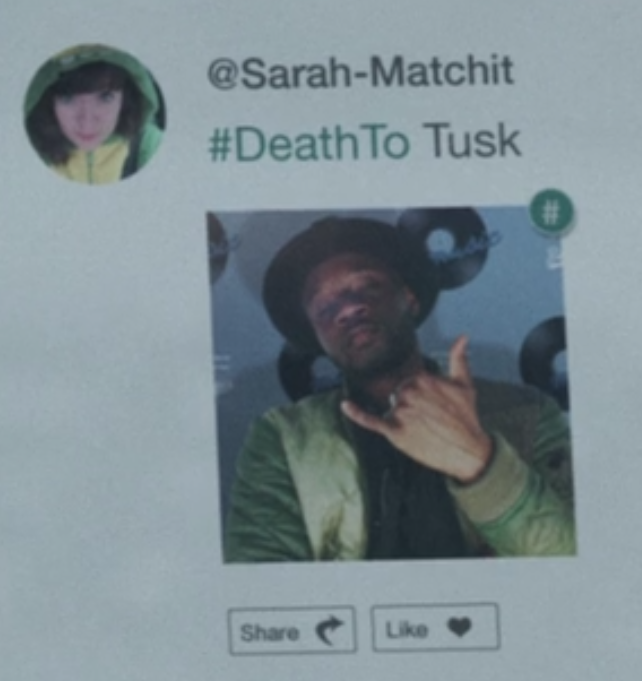
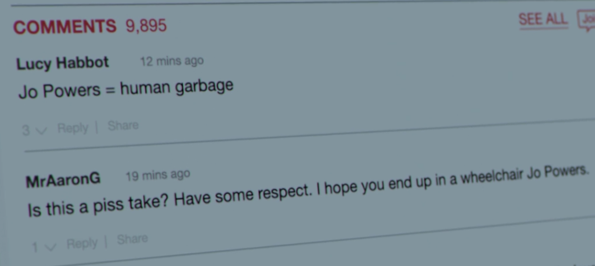
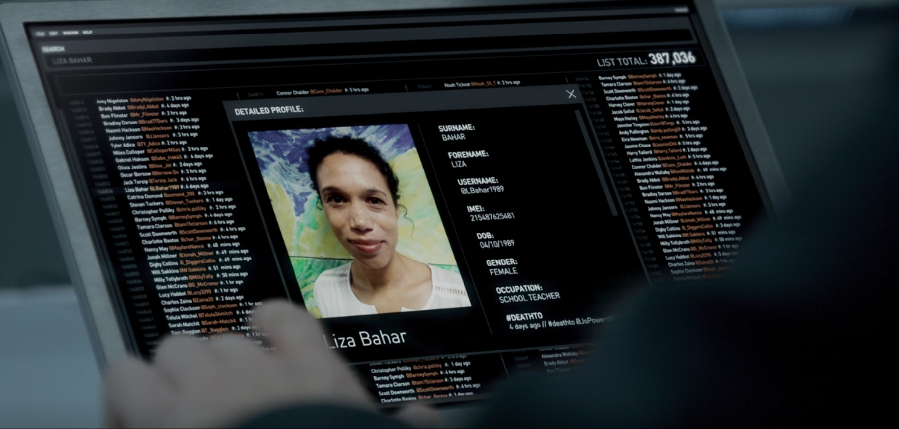

<!--
- [ ] aufteilen - wer sagt was?
- [x] TODOs durchgehen
- [x] folientext ausformulieren
- [x] bilder an passende stellen einfuegen
- [ ] notes ausformulieren
- [ ] s/b/🐝/
-->

**A Musical Prelude:**

<iframe width="949" height="50" src="https://www.youtube.com/embed/aXH4701CEnI" frameborder="0" allow="accelerometer; autoplay; encrypted-media; gyroscope; picture-in-picture" allowfullscreen></iframe>

Source: <a href="https://9gag.com/gag/a73MqYw">https://9gag.com/gag/a73MqYw</a> 

  
Note:
to quote dean martin: let me tell you 'bout the birds and the bees ...

---

# Hated In the Nation

**Content Note:** remote killing, dehumanization. also, some gifs to lighten up the mood every now and then.

Note:

(sabrina) // start presentation with information that the episode deals with **Dual Use** and **Back Doors**, with sprinkles of **image/facial recognition**, **3d printing/federating** and **cyber bullying** // also, we want to make the presentation less linear and will inlcude information on the plot throughout the presentation where/when it fits

---

# Dual Use I

<blockquote> 
 …goods, software and technology that can be used for both civilian and military applications and/or can contribute to the proliferation of WMDs…
  </blockquote> 
<cite>European Commission, [15]</cite>

Note:
(sabrina)
* what is civil, what is military? where/what is police work? if police is civil, then there are lots of technologies with harmful intents.
* what constitutes a  weapons of mass destruction (WMD) -- are the ADIs WMDs? [11]

---

# Dual Use II

<blockquote> 
  for military or other purposes with non-peaceful intents (…) like artificial intelligence and genetics which can be easily weaponised
</blockquote>
  <cite>Datta Burton et al. [10], p. 5</cite>
  
---

# Dual Use III

<blockquote> 
 does your research affect current standards in military ethics? Does your research involve the development of technologies or the creation of information that could have severe negative impacts on human rights standards (e.g. privacy, stigmatization, discrimination), if misapplied?
</blockquote>
  <cite>Datta Burton et al. [10], p. 23</cite>

Note:
(sabrina)
* this is the 2014 version of the EU DU checklist 
* ethics checklist on DU is a requirement only for researchers who want their project to be funded by the EU?
* it's all about the trade-offs -- economy vs. personal security, surveillance, privacy, human rights, ...
* see also discussion about China having an advantage because they don't care about ethics "as much as Europe does" (which IMO is not much to begin with)

---

# Autonomous Drone Insects (ADIs)

  
Note:
* artificial honey bee replacement
* used for pollination
* not controlled by a central server
*  self-replicating
* used civilly to prevent environmental catastrophe
* because honey bees have died out - and as we all know, no other insects pollinate, ever
* open question: do they produce honey?

---

## ADIs - Second Use

 

source: [wikimedia](https://commons.wikimedia.org/wiki/File:Predator_and_Hellfire.jpg)

Note:
* funded by the government
* have a backdoor for surveillance
* government/secret service use them

* massive privacy invasion
* bees are basically invisible -> hard to protect against
* data *is* transmitted, we see examples of videofeeds and position data

---

## Spoiler Alert!

Note:
* basic problem of backdoors: 
  * they can be used by third parties
  * they break security by design

---

## ADIs - Backdoor

<!--
static with speech-bubbles:
https://www.google.com/search?biw=1525&bih=735&tbm=isch&sa=1&ei=MTwFXKrRPIWWjgbO7In4DA&q=nein+doch+oh+gif+captions&oq=nein+doch+oh+gif+captions&gs_l=img.3...6042.7126..7281...0.0..0.152.1084.0j8......1....1..gws-wiz-img.jL5PXueaZfQ#imgrc=62Gl4KCFEgT9AM:
-->

Note: 
* they got hacked.
* security-discussion later with other "improvements"

---

## Introduction: the Plot

Note:
* honey bees have died out and have been replaced by ADIs
* because there's no other possible way to pollinate plants (or maybe it is for the honey?)
* someone took over some ADIs
* and used them to kill people
* controlled via (as of now) unknown means

---

## Image Recognition

source: [flickr](https://www.flickr.com/photos/gastev/15632628574)

Note:
(sabrina)
* used by ADIs to find ~~victims~~ flowers
* dual use: 
  * helping you sort and find pictures
  * used for surveillance
* side-rant: face-recognition
* side-rant: lack of researchers' responsibility

* facial recognition: 
really not as good as people say it was. cf Berlin Südkreuz, with "success" rates of about 75 % (resulting in hundreds of false positives for ONE true positive)

---

## 3D Printing

Note:
* ADIs are self-reproducing devices
* civil use:
  * cheap mass production that can be relocated
  * usable in many different contexts
  * easily getting replacement parts (e.g. for medical devices)
  * ability to easily personalize everything, up to implants
* military use
  * can be used for producing weapons, too

* ADIs build hives, hives reproduce ADIs (from what resources, though?)

---

# The Plot: Target Selection

Note:
* targets are selected via pseudo twitter
* hate-hitlist that's generated via counting #deathTo tweets
* victims get recognized via uploaded image and image recognition
* started by the "the game of consequences" video in the episode

---

# Excursus: Cyber Bullying

Note:

* not part of the papers, but relevant here
* ask whether game of consequences is a good way to deal with cyber bullying
* it is, basically, just trying to hold people responsible for things they said/did online

---

# That Big-Ass Database

Note:
* in the episode, the database is only used as big ass phone book
* but it DOES have a big dual use potential -- as do all other surveillance methods
* reverse image lookup is obviously possible, proof of concept by blue
* side-rant: surveillance is maybe not always the best idea
* most unrealistic part: current, good-quality pics of everyone. and that's pretty scary, innit?

* also: databases like that are usually *not* secure - lampshaded in the episode

---

# Back to the Plot

<!--
static:  -->

Note:
* bees will cooperate -- who would've thunk. else, they'd probably all target the same tree/flower time and again?
* bees are pretty much unkaputtbar - some may be taken out, but they are self-replicating
* discussion: bees are only turned off when prime minister gets targeted, not when other people are

---

# Kill Lists

Note:
* turns out, some guy does this to show that bullying is bad
* because his girl friend got bullyied on social media and committed suicide
* actual "game of consequences" is triggered by bee-killswitch
* victims are those that USED #deathTo

real life comparison:
* several countries groups *have* kill lists
* eg: the US, Syria, the NATO, Russia,... [16]
* terrorists, "dangerous people", etc.

---

# Terror Tuesday

Source: [Wikimedia Commons](https://commons.wikimedia.org/wiki/File:Death_Note,_Book.svg)

Note:
* terror tuesday: weekly time in the POTUS' schedule for approving targeted assassinations
* targeted assassinations executed by: all the above, france, the UK
* quellen: [16], [17], [18]

<!-- the drone-strike on family vid  - nope, too graphic/depressing -->

---

# Drone Killings

Photo: [Stephen Melkisethian](https://www.flickr.com/photos/stephenmelkisethian/15440228802/in/photolist-pwpd6q-o2xXcV-nhy3vH-36BKyv-bYcJ6s-66E8fu-bXvxgm-hs9gHM-fmBB1X-iLvBb7-nkTfWJ-dHkxbE-3jAjTF-kGJLiY-a1gXcN-kjTPNB-euGaH9-g3GVCn-hpDP1Z-puotz9-e2fUQf-dkLpYZ-qMUsc4-DhciEQ-tVgwTv-8C7wnY-niNBDQ-omi8xg-4Ajswp-qk6NXE-dp2Qz9-f81YTF-rAHRTd-rmSK2J-nXgmr3-7pcaik-oageb3-7pg2Sb-eiA5LB-7ByiT3-qhDigK-7J6MzM-nVEe35-mhxdbk-qokmec-bbHupc-7JaJ21-dJp7Q3-p8KpeC-kMJGxx) / Flickr Creative Commons

source:  “Most US Drone Strikes in Pakistan Attack Houses.” The Bureau of Investigative Journalism. Accessed December 17, 2018. https://www.thebureauinvestigates.com/stories/2014-05-23/most-us-drone-strikes-in-pakistan-attack-houses. 

  
Note:

* currently happening - see terror tuesday
* parallels can be seen between actual drone killings and that episode
* bees are basically smaller drones & "only" targetted individuals get killed

---

# Drone Killings II

<iframe width="560" height="315" src="http://drones.pitchinteractive.com/" frameborder="0" allowfullscreen></iframe>

Note: 
* information on drone strikes in Pakistan since 2004
* bar on top shows: number of killings in categories -- left to right: children, civilians, high profile, "other"
* graphic below: same data as above, but for each drone strike 

--- 

# Recap - angesprochene Themen

* Autonomous Drones
* Image Recognition
* 3D Printing
* Surveillance
* Cyber bullying
* Drone killings

🐝🦜🌸🐝🐝🏃‍♀️🐝🐝🐝😱💀🐝🐝💻🐝🐝🐝🐝🐝🐝💀💀💀💀💀💀💀💀

---

# Potential Fixes

no info on (c): https://medium.com/s/story/how-to-fix-what-social-media-has-broken-cb0b2737128

should be ok to use: medium's ToS allow only own pics or pics where the author holds all necessary rights

Note:
* bees: can't really be made "hacking proof"
  * networking & updateable: can be taken over via update process
  * non-networking: all security flaws are permanent
  * malicious users easily get access to individual ADIs or hives
* environmental conservation effort probably preferable
* plus, there are other pollinating insects, we promise

* dual use: can only be fixed with increased ethical understanding
  * of computer scientists, which is a whole other can of worms

other stuff

---

# Discussion Questions

What do you think about the **"game of consequences"**?

<!--
What is scarier: autonomous killer drones existing or being controlled by majority vote? // not sure about this one; sthg related to how present-time killer drones are controlled -->

Where do you think the **biggest fuck-up** leading to this scenario happened?

Do you think using the **ADIs for surveillance** is defensible? What about that **database**?

---

# Sources

[09]: Burton, Saheli Datta, Christine Aicardi, Tara Mahfoud, and Nikolas Rose. “Relative Gains or Human Security?” Human Security, n.d., 34.
[10]: Burton, Saheli Datta, Christine Aicardi, Tara Mahfoud, and Nikolas Rose. “Understanding Interstate Competitiveness and International Security in European Dual-Use Research.” In Biomimetic and Biohybrid Systems, edited by Vasiliki Vouloutsi, José Halloy, Anna Mura, Michael Mangan, Nathan Lepora, Tony J. Prescott, and Paul F.M.J. Verschure, 10928:129–33. Cham: Springer International Publishing, 2018. https://doi.org/10.1007/978-3-319-95972-6_14.
[11]: “What Makes a Weapon One of Mass Destruction?-News-UK-TimesOnline,” March 11, 2007. https://web.archive.org/web/20070311090139/http://www.timesonline.co.uk/tol/news/uk/article1013136.ece.
[12]: GmbH, news networld Internetservice. “Personenstandsregister: Daten von Geburt bis Tod zusammengeführt.” news.at, October 29, 2014. https://www.news.at/a/personenstandsregister-daten-zusammengefuehrt.
[13]: “Zentrales Personenstandsregister (ZPR).” Accessed December 19, 2018. https://www.bmi.gv.at/414/start.aspx.
[14]: “Personenstandsregister: Das Standesamt ist ein Serverraum - derStandard.at.” DER STANDARD. Accessed December 19, 2018. https://derstandard.at/2000007395181/Personenstandsregister-Das-Standesamt-ist-ein-Serverraum#.
[15]: “Dual-Use Trade Controls - Trade - European Commission.” Accessed December 19, 2018. http://ec.europa.eu/trade/import-and-export-rules/export-from-eu/dual-use-controls/index_en.htm.
[16]: “Kill Lists | Clive Stafford Smith on State-Sponsored Assassination.” TheTLS. Accessed December 19, 2018. https://www.the-tls.co.uk/articles/public/state-sponsored-assassination/.
[17]: Whitehead, John W. “Terror Tuesdays, Kill Lists and Drones: Has the President Become a Law Unto Himself?” Huffington Post (blog), June 20, 2012. https://www.huffingtonpost.com/john-w-whitehead/terror-tuesdays-kill-list_b_1606371.html.
[18]: Cobain, Ian. “Obama’s Secret Kill List – the Disposition Matrix.” The Guardian, July 14, 2013, sec. US news. https://www.theguardian.com/world/2013/jul/14/obama-secret-kill-list-disposition-matrix.

---